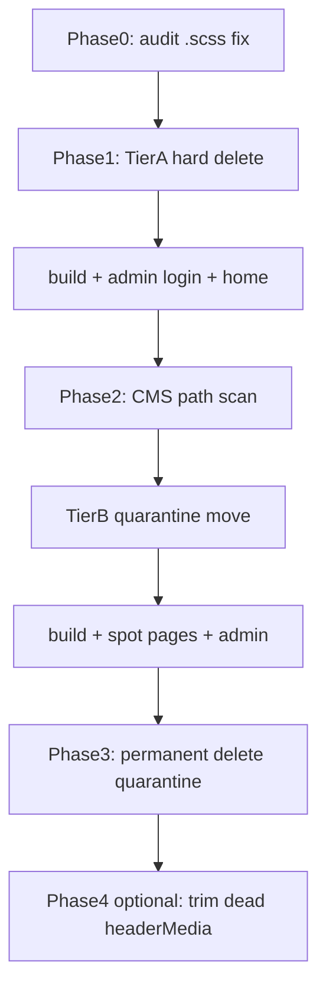

# Güvenli içerik temizliği planı

**Amaç:** Kullanılmayan public medyayı önyüz ve Payload admin’i bozmadan temizlemek.  
**Kaynak envanter:** [kullanilmayan-icerik-raporu.md](./kullanilmayan-icerik-raporu.md)  
**Araç:** `npm run audit:unused-content`

Bu plan onaylanmadan dosya silinmez.

---

## Güvenlik ilkeleri

1. **Önce karantina, sonra sil** — Tier B dosyalar doğrudan silinmez; `public/_quarantine/YYYYMMDD/` altına taşınır, smoke test geçerse kalıcı silinir.
2. **CMS path kontrolü zorunlu** — Payload `siteMediaField` alanları public path tutabilir (`src` / `poster`). Silmeden önce aday path’ler DB’de aranır.
3. **Korunan dosyalar (asla silinmez)**
   - `/honeycomb.svg` — admin UI: `src/styles/admin/shell.scss` (`url("/honeycomb.svg")`)
   - `/logo.svg`, `/admin-login-logo.svg`, `/desen.svg`
   - `public/social-media/*` — Instagram fallback (`src/content/instagram.ts`)
   - `public/site-media/gallery/*` + `gallery-media.generated.ts`
   - Kodda path’i geçen tüm `PAGE_MEDIA` / nav / hero medyası
   - `src/content` PDF + extract arşivi (runtime değil; kaynak)
4. **Audit düzeltmesi (Phase 0)** — `scripts/find-unused-content.py` şu an `.scss` taramıyor; bu yüzden `honeycomb.svg` yanlış yetim. `CODE_EXT`’e `.scss` eklenir; path eşlemesi sıkılaştırılır.



---

## Phase 0 — Audit güvenilirliği

- `scripts/find-unused-content.py`:
  - `CODE_EXT` içine `.scss` ekle
  - Dosya adı yerine mümkün olduğunca **tam public path** ile “used” kararı ver (Instagram dosya adı `site-media` kopyasını yanlış “used” göstermesin)
- `npm run audit:unused-content` ile raporu yenile
- Beklenen: `honeycomb.svg` yetim listesinden düşer; Instagram’ın 8 `site-media` ikizi yetim/aday olarak görünür

---

## Phase 1 — Tier A: kesin yetimler (~388 MB)

Kod + admin CSS’te path yok. Silmeden önce yine kısa CMS path grep (aşağıdaki liste).

| Dosya | Gerekçe |
|---|---|
| `/videos/sanat.mov`, `/videos/sanat-poster.jpg` | Kullanılmıyor; sitede `/site-media/sanat.jpg` var |
| `/videos/akademik-gelisim-poster.jpg` | Nav/PAGE_MEDIA bu posteri kullanmıyor |
| `/videos/sultanda-yasam-poster.jpg` | `PAGE_MEDIA.sultandaYasamVideo` poster olarak `MENU_IMAGES.yasam` kullanıyor |
| `/images/menu-gorselleri/ankara.jpg` | Kod `ankara.png` bekliyor |
| `/file.svg`, `/globe.svg`, `/next.svg`, `/vercel.svg`, `/window.svg` | Next scaffold; referans yok |
| `/sultan-okullari-logo.svg`, `/sultanokullarılogo.svg` | Aktif: `/logo.svg` + `/admin-login-logo.svg` |

**Yapılmayacak:** `/honeycomb.svg` silinmez.

**Doğrulama kapısı:** `npm run build` + admin login (petek desen) + ana sayfa + bir kampüs sayfası.

---

## Phase 2 — Tier B: WA dump + Instagram ikizleri (karantina)

### 2a. CMS path taraması

Aday path listesi (rapordaki 48 kök `site-media` yetimi + 8 Instagram `site-media` ikizi) için Postgres’te text/JSON alanlarda arama:

- Payload `*.src` / `*.poster` grup alanları
- Eşleşme varsa o dosya listeden **çıkarılır**, silinmez
- Küçük yardımcı: `scripts/check-cms-media-paths.ts` (aday listesini DB’de arar, eşleşenleri raporlar)

### 2b. Karantina taşıma

CMS’te geçmeyenler:

```text
public/_quarantine/20260715/
  site-media/...
```

`.gitignore`’a `public/_quarantine/` eklenir. Track edilen dosyalar için `git rm` sonrası karantinaya kopya veya eşdeğer güvenli taşıma.

### 2c. Instagram ikizleri (aynı phase)

Kod yalnızca `/social-media/VID-….mp4` kullanıyor; `/site-media/` altında aynı isimli 8 kopya path olarak referanssız. CMS temizse karantinaya alınır.

**`public/social-media/` dokunulmaz.**

**Doğrulama kapısı:** build + home Instagram şeridi + `/guncel/medya` + admin login/media smoke + audit yeniden.

---

## Phase 3 — Karantinayı kalıcı sil

Phase 2 smoke testlerinden en az bir başarılı yerel doğrulama sonra `public/_quarantine/` içeriği silinir.  
Geri alma: önceki commit / karantina yedeği.

---

## Phase 4 (opsiyonel, medya silmez) — `headerMedia` sadeleştirme

`src/content/site-media.ts` içinde yalnızca kullanılan anahtarlar kalsın:

- **Koru:** `insanKaynaklari`, `atolyeler`
- **Kaldır:** diğer 16 ölü anahtar

Dosya silmez. Önce `rg "headerMedia\\." src` ile teyit.

---

## Bilinçli olarak kapsam dışı

| Öğe | Neden |
|---|---|
| `Görsel/`, `media/` | Gitignore kaynak; site servisi değil |
| PDF / `_pdf-extract.txt` vb. | İçerik kaynağı |
| `docs/reference/design-v2-source/` | Arşiv; küçük |
| Gallery havuzu | Aktif ve üretilmiş |
| CMS upload storage | Ayrı envanter; bu plan public path odaklı |

---

## Test planı (her phase sonrası)

1. `npm run build` (veya en azından `typecheck`)
2. Admin: `/admin` login — petek arka plan + logo görünür
3. Önyüz: `/`, `/yasam/sultanda-yasam`, bir `/okullarimiz/...`, Instagram satırı video oynatır
4. `npm run audit:unused-content` — yetim sayısı düşer; `honeycomb` yetim değildir
5. CMS path scan: silinen path’lere 0 hit

---

## Uygulama sırası

Phase 0 → Phase 1 → doğrula → Phase 2a/2b → doğrula → Phase 3 → (isteğe bağlı) Phase 4.

**Tahmini kazanç:** Tier A ~388 MB + Tier B ~87–100 MB ≈ **~475–490 MB**, admin/önyüz riski minimum.

**Kritik uyarı:** Mevcut audit raporundaki `/honeycomb.svg` satırı **yanlış pozitif**; admin panel deseni için zorunlu. Temizlikte asla silinmeyecek.
