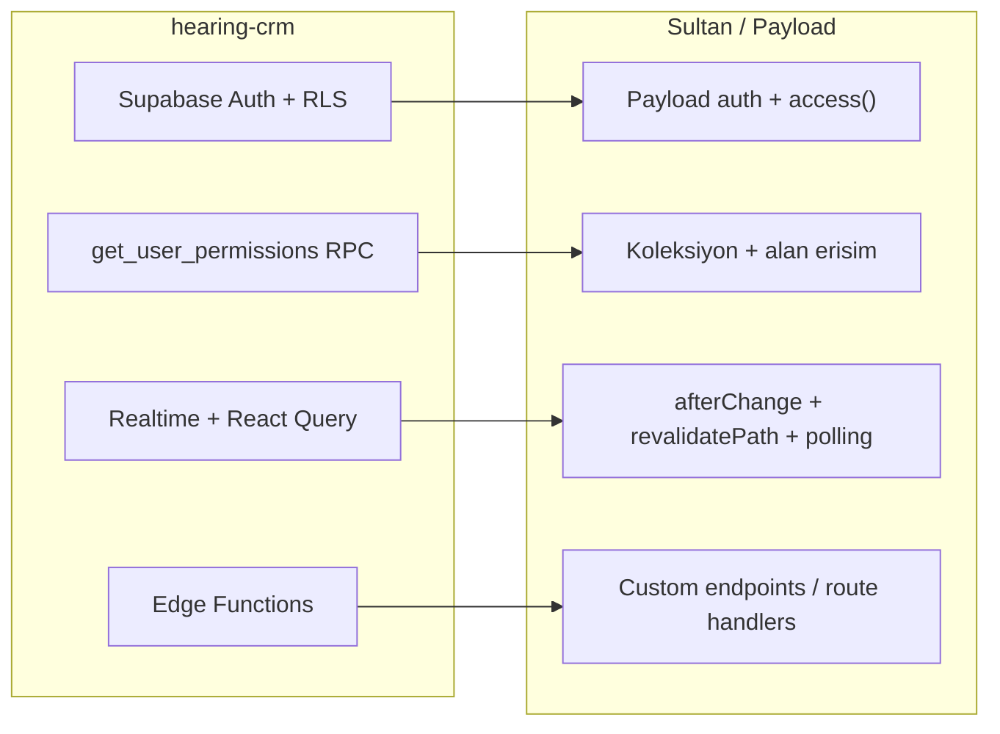

# Hearing CRM → Sultan Okulları Aktarım Rehberi

> **Amaç:** `hearing-crm` projesinde önceden geliştirilmiş, olgunlaşmış özelliklerin bilgi birikimini (know-how) Sultan Okulları Yönetim Paneli'ne aktarmak. Burada hedef, bir kod bloğunu doğrudan kopyalamak değil; her özelliği Sultan'ın mimarisine (Next.js + Payload CMS + PostgreSQL) ve amacına (çok kampüslü okul sitesi + içerik yönetimi + ziyaretçi etkileşimi) **uygun ve faydalı biçimde uyarlamaktır**.

---

## 1. Yönetici Özeti

Bu belge iki projeyi karşılaştırır ve `hearing-crm`'deki özelliklerden Sultan Okulları Yönetim Paneli'ni geliştirebilecek olanları, **nasıl uyarlanabilecekleriyle** birlikte ayrıntılı olarak listeler.

**İki proje neden karşılaştırılabilir?** `hearing-crm` bir CRM olsa da, altında yatan pek çok altyapı özelliği (kullanıcı/rol/izin yönetimi, yetkilendirme katmanları, bildirimler, şifre sıfırlama, denetim kaydı, yönetici paneli UX desenleri) **her yönetim paneli için ortaktır**. Sultan Okulları bir CRM değildir; ancak hem bir **CMS** (içerik yönetimi) hem de **ziyaretçilerle etkileşen bir okul sitesidir** (iletişim formu, İK başvurusu, "Sizi Arayalım" modalı). Bu ikili doğa, `hearing-crm`'in panel tarafı olgunluğundan doğrudan fayda sağlar.

**En yüksek değerli aktarım fırsatları (özet):**

| # | Özellik | Sultan'daki karşılık | Değer | Karmaşıklık |
|---|---------|----------------------|-------|-------------|
| 1 | Panel-içi bildirim merkezi (zil + rozet + geçmiş) | Yalnızca inbox e-posta + rozet | Yüksek | Orta |
| 2 | Denetim kaydı kapsamı + alan-bazlı diff | Kısmi audit, diff yok | Yüksek | Düşük–Orta |
| 3 | Zenginleştirilmiş gösterge paneli (KPI/aktivite/onay bekleyenler/grafik) | Basit `DashboardWelcome` | Yüksek | Orta |
| 4 | Kampüs (şube) bazlı ince-taneli editör yetkisi | Kaba-taneli 3 rol | Yüksek | Yüksek |
| 5 | Kullanıcı davet + aktif/pasif yaşam döngüsü | Yalnızca Payload create | Orta | Orta |
| 6 | Türkçe şifre sıfırlama / e-posta akışı | Payload varsayılan (pasif) | Orta | Düşük |
| 7 | Inbox/İK kayıtları için dışa aktarma (Excel/CSV) | Yok | Orta | Düşük |
| 8 | Toplu işlemler (yayınla/arşivle) içerik koleksiyonlarına | Yalnızca inbox toplu | Orta | Düşük |
| 9 | Yumuşak silme / çöp kutusu (geri al) | Kalıcı silme | Orta | Orta |
| 10 | Global komut paleti (⌘K) | Yok | Düşük | Orta |

**Temel ilke:** `hearing-crm` bu yeteneklerin çoğunu **Supabase (Postgres + RLS + Edge Functions + Realtime)** üzerine kurmuştur. Sultan ise **Payload CMS 3**'ün yerleşik kimlik doğrulama, erişim (access), hook ve custom admin bileşen sistemini kullanır. Bu nedenle aktarım = SQL/RLS/React Query desenlerini **Payload access fonksiyonlarına, koleksiyonlara, hook'lara ve custom admin bileşenlerine** çevirmektir.

---

## 2. Karşılaştırmalı Mimari

| Katman | hearing-crm | Sultan Okulları |
|--------|-------------|-----------------|
| İstemci | Vite + React SPA (client-side) | Next.js 16 App Router (server components ağırlıklı) |
| Yönetim paneli | Uygulamanın kendisi (özel yapım) | Payload CMS `/admin` (hazır panel + custom bileşenler) |
| Kimlik doğrulama | Supabase Auth (JWT, hCaptcha, e-posta onayı) | Payload auth (Users koleksiyonu, cookie/JWT) |
| Yetki (yatay) | RLS + `has_permission`/`has_role` RPC | Payload `access()` fonksiyonları (koleksiyon + alan) |
| Veri erişimi | `@supabase/supabase-js` + React Query | Payload Local API / REST + Next.js server fetch |
| Arka plan işleri | Supabase Edge Functions (Deno) | Next.js route handler'ları + Payload hook'ları + CRON |
| Anlık güncelleme | Supabase Realtime (`postgres_changes`) | `revalidatePath` + live preview; realtime yok |
| İstemci durumu | React Query (invalidation) | Server components + revalidate; panelde custom fetch |

**Kavram aktarımı ilkesi:** `hearing-crm` React bileşenleri (örn. `RequirePermission`) ve Supabase SQL'i (örn. RLS politikaları) **birebir taşınamaz**. Bunun yerine aynı *davranış*, Payload'un yapı taşlarıyla yeniden ifade edilir: rota koruması yerine koleksiyon `access` fonksiyonları, RPC yerine hook + Local API sorguları, realtime yerine polling.

**Sürüm uyarısı:** Sultan reposundaki `AGENTS.md`, "This is NOT the Next.js you know" der ve kod yazmadan önce `node_modules/next/dist/docs/` içindeki ilgili rehberin okunmasını ister. Aynı dikkat Payload 3.86 için de geçerlidir: alan tipleri, `access` imzaları ve admin bileşen API'leri sürüme özgüdür. Aşağıdaki her uyarlama, uygulamadan önce ilgili Payload sürüm belgesiyle teyit edilmelidir.

---

## 3. Ek Derinlik İstenen Konular

Her başlık şu şablonu izler: **(a) hearing-crm'de nasıl → (b) Sultan'daki mevcut durum → (c) uyarlama yaklaşımı → (d) etkilenen dosyalar → (e) not/risk.**

### 3.1 Rol ve İzin Yönetimi (RBAC)

**(a) hearing-crm'de nasıl.** Çok katmanlı, ince-taneli bir RBAC:

- **Roller** (`app_role` enum): `admin`, `branch_manager`, `staff` (+ eski `user`, `user_manager`). Kullanıcı ↔ rol eşlemesi `user_roles` tablosunda.
- **İzin kataloğu** `permissions` (kaynak + eylem çiftleri, örn. `customer:create`), rol varsayılanları `role_permissions`, kullanıcıya özel geçersiz kılmalar `user_permissions` (`state = granted | revoked`).
- **Şube kapsamı** `user_branch_assignments` (`scope = view | edit | manage`) — kullanıcı yalnızca atandığı şubelerin verisine erişir.
- **Etkin izin çözümü:** sunucuda `get_user_permissions(target_user_id)` RPC'si, rol mirası ± kullanıcı geçersiz kılmalarını birleştirir; istemcide `src/contexts/AuthContext.tsx` bunu bir `PermissionMap`'e dönüştürür ve `hasPermission(resource, action)` / `hasRole(role)` sunar.
- **UI koruması:** rota düzeyinde `src/components/access/RequirePermission.tsx` (varsayılan eylem `view`), rolsüz kullanıcılar için `src/components/access/NoRoleGuard.tsx`, menü/komut paleti filtrelemesi. Katalog vokabüleri `src/lib/onboardingConstants.ts` içinde.

**(b) Sultan'daki mevcut durum.** Kaba-taneli, üç sabit rol: `admin` (Yönetici), `editor` (Editör), `inbox` (Gelen Kutusu) — `src/collections/Users.ts` içinde `roles` (hasMany) alanı, JWT'ye kaydedilir. Erişim, `src/payload/access/index.ts` içindeki yardımcılarla verilir (`isAdmin`, `isAdminOrEditor`, `draftContentCollectionAccess`, `inboxCollectionAccess` vb.). Görünürlük `src/payload/admin-visibility.ts` (`hideUnlessAdmin`, `hideFromInboxOnly`). Kaynak+eylem düzeyinde ince-taneli izin veya kullanıcıya özel geçersiz kılma **yoktur**; kampüs bazlı kısıtlama **yoktur** (bir editör tüm şubelerin içeriğini düzenleyebilir).

**(c) Uyarlama yaklaşımı.**

1. **Küçük adım — daha fazla rol + alan/koleksiyon access ayrıştırması:** Acil ince-taneli ihtiyaç yoksa, mevcut rol setini genişletmek (örn. `editor_haber`, `editor_kampus`) ve `access/index.ts` yardımcılarını çeşitlendirmek yeterli olabilir. Düşük maliyetli.
2. **Orta adım — kampüs bazlı editör yetkisi (yüksek değer):** Sultan çok kampüslüdür (`src/collections/Branches.ts`). `hearing-crm`'in `user_branch_assignments` fikri buraya doğrudan uyar. Uygulama:
   - `Users` koleksiyonuna `assignedBranches` (Branches'e `relationship`, hasMany) alanı eklenir.
   - `News`, `Events`, `Staff`, `Branches` gibi koleksiyonların `access.update`/`access.read` fonksiyonları, `req.user.roles` admin değilse dokümanın şubesini kullanıcının `assignedBranches` listesiyle karşılaştıracak şekilde genişletilir (Payload access fonksiyonları `where` filtresi döndürebilir — liste sorgularını da otomatik daraltır).
   - Bu, `hearing-crm`'deki `has_branch_access()` RLS mantığının Payload karşılığıdır.
3. **Büyük adım — tam ince-taneli izin modeli:** Gerçekten kaynak+eylem düzeyinde kullanıcıya özel izin gerekiyorsa:
   - Yeni koleksiyonlar: `RolePermissions` (rol → koleksiyonSlug → eylem) ve `UserPermissions` (kullanıcı → koleksiyonSlug → eylem → granted/revoked). Bu, `role_permissions` + `user_permissions` ikilisinin karşılığıdır.
   - Merkezî bir `resolvePermissions(user)` yardımcısı (Payload Local API ile bu tabloları okuyarak `get_user_permissions` RPC'sinin işini yapar), sonuçları access fonksiyonlarında ve custom admin bileşenlerinde kullanılır.
   - "Kaynak" = Payload koleksiyon slug'ı; "eylem" = `read | create | update | delete` (+ Sultan'a özel `publish`). Bu eşleme, `hearing-crm`'in `resource/action` modelini Payload'a doğal biçimde taşır.

**(d) Etkilenen dosyalar:** `src/collections/Users.ts`, `src/payload/access/index.ts`, `src/payload/admin-visibility.ts`, ilgili koleksiyonların `access` blokları; (büyük adımda) yeni `src/collections/RolePermissions.ts`, `src/collections/UserPermissions.ts` ve bir `src/payload/access/resolve-permissions.ts`.

**(e) Not/risk.** Tam ince-taneli modele geçmeden önce **kampüs bazlı yetki** en yüksek getiri/maliyet oranına sahiptir. Payload access fonksiyonlarının `where` döndürme yeteneği, `hearing-crm`'in RLS'ini tek noktada taklit etmeye izin verir; bu sayede hem panel listeleri hem de API otomatik daralır. Payload'da izin JWT'de taşınıyorsa, izin değişikliğinin oturuma yansıması için yeniden giriş/oturum tazeleme gerekebilir.

### 3.2 Yetkilendirme ve Kullanıcı Yaşam Döngüsü

**(a) hearing-crm'de nasıl.** Public kayıt açıktır ama üç kapılı bir onay hattı vardır: Supabase e-posta onayı → `profiles.approved` (admin onayı) → RBAC. Yönetici işlemleri:

- **Davet:** `supabase/functions/invite-user/index.ts` — `auth.admin.inviteUserByEmail` ile davet, metadata `invited_by_admin: true` → DB trigger daveti otomatik onaylar.
- **Onboarding (atomik kurulum):** `supabase/functions/apply-onboarding/index.ts` — tek çağrıda profil + tek rol + şube atamaları + özel izinleri kurar.
- **Yaşam döngüsü:** onayla/reddet/aktifleştir/pasifleştir (`profiles.approved/is_active/rejected`), toplu işlemler, `UserOnboardingWizard` sihirbazı; rolsüz kullanıcılar `NoRoleGuard` ile yalnız `/` ve `/profile`'a erişir; `AuthVerify` ve `ProtectedRoute` onaysız/pasif kullanıcıyı oturumdan atar.

**(b) Sultan'daki mevcut durum.** Public kayıt **yoktur**; panel kullanıcıları yönetici tarafından oluşturulur. İlk kullanıcı otomatik `admin`, sonrakiler varsayılan `editor` (`src/collections/Users.ts` hook'ları). Payload'un 5 hatalı denemede 10 dk kilit özelliği aktiftir. Onay/aktivasyon/davet/pasifleştirme akışı ve rol atama sihirbazı yoktur.

**(c) Uyarlama yaklaşımı.** Sultan CRM olmadığından "public kayıt onayı" **gereksizdir**; `hearing-crm`'in bu bölümü olduğu gibi taşınmaz. Değerli parçalar:

1. **Davet ile ekleme + ilk şifre belirleme:** Payload'un `auth`'ında `verify`/`forgotPassword` mekanizmaları bu akışa uyarlanır. Yönetici bir Users kaydı oluşturur; sistem, kullanıcıya şifre belirleme bağlantısı gönderir (Payload'un `forgotPassword` e-postası "davet" olarak yeniden metinlenir). Bu, `invite-user` edge fonksiyonunun Payload karşılığıdır ve SMTP gerektirir (bkz. 3.3).
2. **Aktif/Pasif kullanıcı:** `Users`'a `isActive` (checkbox, admin-only) alanı; bir `beforeLogin` hook'u veya login access kontrolü pasif kullanıcının girişini engeller. Bu, `profiles.is_active` + `AuthVerify` mantığının sadeleştirilmiş karşılığıdır.
3. **Rol + kampüs atama sihirbazı:** `apply-onboarding`'in "tek yerde rol + kapsam" fikri, kullanıcı düzenleme ekranında `roles` + `assignedBranches` (bkz. 3.1) alanlarıyla ya da bir custom admin view ile karşılanır.

**(d) Etkilenen dosyalar:** `src/collections/Users.ts` (`isActive`, `beforeLogin`/`access`), `src/payload.config.ts` (e-posta adapter), gerekirse `src/components/payload/admin/` altında bir davet/onboarding görünümü.

**(e) Not/risk.** Public onay hattını taşımak Sultan için gereksiz karmaşıklıktır; yalnızca **davet + aktif/pasif** parçaları alınmalı. Pasifleştirmenin oturum açık kullanıcıyı da düşürmesi için access kontrolü her istekte çalışan bir kapıya bağlanmalıdır.

### 3.3 Şifre Sıfırlama ve E-posta Yönetimi

**(a) hearing-crm'de nasıl.** "Şifremi unuttum" → `resetPasswordForEmail(redirectTo: /auth)` → e-posta bağlantısı → `PASSWORD_RECOVERY` olayı → `needsPasswordReset` bayrağı → yeni şifre formu → `updateUser({ password })`. Recovery/magic-link tipini React yüklenmeden önce yakalamak için `index.html`'de erken bir bootstrap betiği vardır. E-posta değişikliği (`src/pages/Profile.tsx`) **çift onaylıdır** (hem eski hem yeni adres) ve `/auth/email-change-confirmed`'e yönlenir; bir DB trigger `profiles.email`'i `auth.users` ile senkronlar. Tüm redirect URL'leri Supabase Dashboard'da yapılandırılır.

**(b) Sultan'daki mevcut durum.** Payload `auth` şifre sıfırlamayı yerleşik olarak sağlar (`forgot-password` / `reset-password` REST + admin akışı), ancak **e-posta gönderimi SMTP'ye bağlıdır**. `src/payload.config.ts` yalnızca `SMTP_HOST` tanımlıysa `nodemailerAdapter` kurar; aksi halde e-postalar konsola yazılır. Türkçe şablon özelleştirmesi ve uçtan uca akış belgelenmemiştir.

**(c) Uyarlama yaklaşımı.**

1. **Payload'un yerleşik akışını etkinleştir ve Türkçeleştir:** `Users` auth yapılandırmasında `forgotPassword.generateEmailHTML`/`generateEmailSubject` ile **Türkçe şablonlar**; `hearing-crm`'in kullanıcı deneyimi metinleri (net yönlendirme, süre uyarısı) referans alınır. Panelin kendi `/admin/forgot` akışı zaten mevcuttur; asıl iş SMTP + şablon + Türkçe metindir.
2. **SMTP yapılandırması:** `.env` içinde `SMTP_HOST` (+ opsiyonel auth) tanımlanır; adapter zaten hazırdır.
3. **E-posta değişikliği:** Payload'da e-posta bir auth alanıdır; `hearing-crm`'in "çift onay" davranışı isteniyorsa bir `beforeChange`/`afterChange` hook ile doğrulama akışı kurgulanabilir. Çoğu okul paneli için bu, düşük öncelikli bir incelik olarak not edilir.

**(d) Etkilenen dosyalar:** `src/payload.config.ts` (email adapter + `Users` auth `forgotPassword` seçenekleri), `.env` (SMTP), `src/collections/Users.ts`.

**(e) Not/risk.** `hearing-crm`'deki `index.html` recovery-bootstrap ve hash yönetimi Payload'da **gereksizdir** (Payload akışı token'ı URL parametresiyle taşır). Aktarılan asıl değer: Türkçe şablonlar + net UX + SMTP'nin canlıda mutlaka yapılandırılması.

### 3.4 Bildirimler

**(a) hearing-crm'de nasıl.** İki paralel sistem:

- **Kalıcı panel-içi bildirimler:** `notifications` tablosu (`title`, `message`, `type`, `link`, `is_read`). `src/components/notifications/NotificationBell.tsx` okunmamış sayacı + **Supabase Realtime** (`postgres_changes` INSERT aboneliği) + yeni bildirimde `sonner` toast gösterir. `src/utils/notifications.ts` içindeki `notifyOrderEvent`, olayları **rol-bazlı hedefler** (ilgili personel + şube müdürleri + tüm adminler). Kayıt olunca DB trigger "hoş geldin" bildirimi yazar.
- **Anlık geri bildirim:** `sonner` toast'ları operasyonel sonuçlar için (kaydet/hata) her yerde.

**(b) Sultan'daki mevcut durum.** Yalnızca **e-posta** tabanlı inbox bildirimi: `src/payload/hooks/notify-inbox.ts`, yeni iletişim mesajı / İK başvurusu oluştuğunda `INBOX_NOTIFY_EMAIL` alıcılarına e-posta atar (alıcı yoksa yalnız log). Panelde `src/components/payload/admin/InboxNavLinks.tsx` okunmamış sayısını **rozet** olarak gösterir. Panel-içi genel bildirim merkezi ve realtime **yoktur**.

**(c) Uyarlama yaklaşımı.**

1. **Panel-içi bildirim merkezi (yüksek değer):** Yeni bir `Notifications` koleksiyonu (`title`, `message`, `type`, `link`, `user` ilişki, `isRead`) + bir custom admin bileşeni (zil + açılır liste + okundu/sil) `beforeNavLinks`'e eklenir — mevcut `InboxNavLinks` deseni bunun için hazır bir örnektir. `NotificationBell`'in davranışı buraya taşınır.
2. **Realtime yerine polling:** Payload'da `postgres_changes` yoktur; okunmamış sayacı ve liste, `InboxNavLinks`'in halihazırda yaptığı gibi periyodik `fetch` ile tazelenir (örn. 30–60 sn). `hearing-crm`'in dashboard `NotificationsPanel`'i de zaten 60 sn polling kullanır — bu, birebir uyumlu bir modeldir.
3. **Rol-bazlı hedefleme:** `notifyOrderEvent`'in "olayı ilgili rollere dağıt" fikri, Sultan senaryolarına uyarlanır: yeni iletişim/İK kaydı → inbox+admin rollerine panel bildirimi (e-posta zaten var); editör bir içeriği yayına gönderdiğinde → adminlere "onay/inceleme" bildirimi; zamanlanmış yayın gerçekleştiğinde → ilgili editöre bilgi.
4. **notify-inbox'ı genişlet:** Mevcut e-posta hook'u, aynı olayda bir `Notifications` kaydı da yazacak şekilde genişletilir (tek kaynak, iki kanal: e-posta + panel).

**(d) Etkilenen dosyalar:** yeni `src/collections/Notifications.ts`, yeni `src/components/payload/admin/NotificationBell.tsx` (+ `payload.config.ts` `beforeNavLinks`), `src/payload/hooks/notify-inbox.ts` (genişletme), `src/lib/admin-dashboard-data.ts` (sayaç kaynağı).

**(e) Not/risk.** Realtime beklentisi yaratılmamalı; polling aralığı makul tutulmalı. Bildirim koleksiyonuna erişim, kullanıcının yalnızca kendi bildirimlerini görmesi için `access` ile sınırlanmalı (kişisel bildirimler) veya rol-hedefli genel bildirimler için tasarım netleştirilmeli.

### 3.5 Veritabanı Senkronizasyonu / Önbellek / Yeniden Doğrulama

**(a) hearing-crm'de nasıl.** İstemci-sunucu senkronu React Query ile: mutasyon sonrası `invalidateQueries`; iyimser (optimistic) güncelleme yok; yalnız `notifications` tablosunda realtime; dashboard gadget'ında 60 sn polling. Kimlik/izin, kullanıcı değişince `user_roles` + `get_user_permissions` yeniden çekilerek senkronlanır.

**(b) Sultan'daki mevcut durum.** Güçlü ve modern: Payload `afterChange`/`afterDelete` hook'ları `revalidatePath()` çağırır (`src/payload/hooks/revalidate-site.ts`), böylece içerik kaydedilince **anında** siteye yansır; CMS tüketen sayfalar `force-dynamic`. Canlı önizleme `RefreshRouteOnSave` ile otomatik yenilenir. Yani Sultan'ın "DB → site" senkronu `hearing-crm`'den **daha ileridedir**.

**(c) Uyarlama yaklaşımı.** Burada aktarım tek yönlü değildir — Sultan'ın revalidation modeli korunmalıdır. `hearing-crm`'den alınabilecekler:

1. **Panel listelerinde tazelik:** Custom admin bileşenleri (bildirim zili, dashboard sayaçları) için `hearing-crm`'in polling + "değişiklikten sonra tazele" deseni kullanılır.
2. **Çakışma azaltma:** `hearing-crm`'de olmayan ama Sultan'da bulunan `lastEditedBy` (`src/payload/hooks/*`) korunur; eş zamanlı düzenlemede "en son kim düzenledi" görünürlüğü audit ile birlikte güçlendirilir.
3. **İzin değişikliğinin yansıması:** 3.1'deki izinler JWT'de taşınırsa, `hearing-crm`'deki "kullanıcı değişince izinleri yeniden yükle" mantığının Payload karşılığı, oturum tazeleme/yeniden giriş ile sağlanır.

**(d) Etkilenen dosyalar:** çoğunlukla yeni custom admin bileşenleri; mevcut `revalidate-site.ts` ve `audit`/`last-edited-by` hook'ları korunur.

**(e) Not/risk.** Sultan'ın server-component + revalidate modeli, `hearing-crm`'in client-side React Query modelinden farklıdır; iki modeli karıştırmadan, panel-içi custom bileşenlerde polling, site tarafında revalidate kullanılmalıdır.

### 3.6 Denetim Kayıtları (Audit Logs)

**(a) hearing-crm'de nasıl.** `audit_logs` tablosu zengin: `action`, `table_name`, `record_id`, `old_data`, `new_data`, **`changed_fields`** ve `user_id`. Yazım hem DB trigger'ları (çekirdek tablolar) hem de istemciden `src/utils/auditLog.ts` (`logAudit`) ile. Görüntüleme `src/pages/Logs.tsx`: eyleme/tabloya göre filtre + **JSON diff** (INSERT/UPDATE/DELETE, alan bazında eski→yeni). Ayrıca alana özel denetim tabloları (profil/izin/müşteri).

**(b) Sultan'daki mevcut durum.** `src/collections/AuditLogs.ts` var (`summary`, `action`, `collection`, `documentId`, `userEmail`, `userId`, `meta`), yazan `src/payload/hooks/audit-log-hooks.ts`. Ancak: kapsam **kısmi** (hero-slides, branches, news, events, pages, staff, media-items, navigation, site-ayarlari loglanır; journey/neden/instagram/media/inbox durum değişiklikleri/users/ana-sayfa/gayemiz **loglanmaz**), yalnız `req.user` varken yazar (seed/form yazımları denetlenmez) ve **alan-bazlı diff yoktur** (`meta` yalnız `_status` tutar).

**(c) Uyarlama yaklaşımı.**

1. **Kapsamı genişlet:** `createAuditAfterChange`/`AfterDelete` hook'ları eksik koleksiyonlara eklenir; özellikle **inbox durum değişiklikleri** (new→read→archived) denetlenir — okul paneli için başvuru/mesaj işlem geçmişi önemlidir.
2. **Alan-bazlı diff (yüksek değer, düşük maliyet):** `hearing-crm`'in `changed_fields` + eski/yeni değer modeli `AuditLogs.meta`'ya eklenir. `audit-log-hooks.ts` içinde `previousDoc` ile `doc` karşılaştırılıp değişen alanlar ve eski→yeni değerler `meta`'ya yazılır. Böylece "neyin değiştiği" görünür olur.
3. **Diff görüntüleyici:** `Logs.tsx`'in JSON diff arayüzünün karşılığı, AuditLogs için bir custom admin cell/view olarak eklenebilir (alan bazında eski→yeni gösterimi).

**(d) Etkilenen dosyalar:** `src/payload/hooks/audit-log-hooks.ts` (diff üretimi), `src/collections/AuditLogs.ts` (`meta` alan şeması / opsiyonel yeni alanlar + görüntüleyici bileşeni), eksik koleksiyonların hook kayıtları.

**(e) Not/risk.** Diff'te hassas veri (KVKK — iletişim/İK başvurusu kişisel bilgileri) `meta`'ya yazılırken maskeleme/erişim sınırı düşünülmelidir; AuditLogs zaten yalnız admin erişimlidir, bu korunmalı.

---

## 4. Genel Yönetici Paneli UX Aktarımları

`hearing-crm`'in domain'den bağımsız, yeniden kullanılabilir panel desenleri Payload'a şöyle eşlenir:

- **Zenginleştirilmiş gösterge paneli.** `hearing-crm` çok sayıda gadget'a sahiptir (KPI kartları, aktivite akışı, bekleyen onaylar, hızlı eylemler, `recharts` grafikleri). Sultan'da `src/components/payload/admin/DashboardWelcome.tsx` + `src/lib/admin-dashboard-data.ts` zaten temel istatistikleri (taslak sayıları, okunmamış mesaj, yaklaşan etkinlik, son düzenlemeler) sunar. Uyarlama: bu paneli **KPI kartları**, **aktivite akışı** (AuditLogs'tan son N kayıt — `hearing-crm`'in `ActivityFeedWidget` karşılığı), **iş listesi/bekleyen onaylar** (yayın bekleyen taslaklar + okunmamış inbox), **hızlı eylemler** (izin-duyarlı kısayollar) ve isteğe bağlı **grafikler** (aylık başvuru/mesaj trendi, içerik durumu dağılımı; `recharts` eklenerek) ile genişletmek.
- **Toplu işlemler.** Sultan'da yalnız inbox için `InboxBulkActions` var. `hearing-crm`'in `BulkActionBar` deseni, içerik koleksiyonlarına **toplu yayınla/arşivle/taslağa al** olarak yayılabilir (Payload liste görünümünde custom bulk action).
- **Dışa aktarma (Excel/CSV/PDF).** `hearing-crm` her listede export sunar. Sultan için en değerlisi: **iletişim mesajları ve İK başvurularını Excel/CSV** olarak dışa aktarma (raporlama/arşiv). KVKK gereği erişim yalnız yetkili rollerle sınırlı olmalı ve dışa aktarma denetime yazılmalı.
- **Yumuşak silme / çöp kutusu.** `hearing-crm`'de silme geri alınabilir (`is_deleted` + `/deleted` rotaları + `TrashBin` restore/kalıcı sil/30 gün). Sultan'da içerik silme kalıcıdır. Uyarlama: içerik koleksiyonlarına `deletedAt` (soft-delete) alanı + access filtresiyle gizleme + bir "çöp kutusu" görünümü; ya da Payload'un o sürümdeki yerleşik trash yeteneği araştırılarak kullanılabilir (önce Payload 3.86 belgesi teyit edilmeli).
- **Global komut paleti (⌘K).** `hearing-crm`'in `CommandPalette`'i (izin-duyarlı hızlı gezinme) Sultan panelinde bir custom bileşen olarak eklenebilir (düşük öncelik; Payload'un kendi arama/gezinmesi kısmen karşılar).
- **Türkçe hata çevirisi.** `hearing-crm`'in `src/lib/errorMessages.ts` (`translateError`) deseni, sunucu aksiyon hataları için faydalıdır. Sultan'da panelde `afterError` (Türkçe mesaj) zaten var; aynı yaklaşım **site formları** (iletişim/İK server action'ları) için de standardize edilebilir.
- **Self-service profil.** `hearing-crm`'in Profile sayfası (foto, telefon, acil durum, e-posta değişikliği) zengindir. Sultan panel kullanıcıları için Payload'un `account` görünümü temel düzeyi sağlar; istenirse avatar/telefon alanlarıyla genişletilir (düşük öncelik).

---

## 5. Aktarılmayacaklar (Domain'e Özel) ve Gerekçeleri

Aşağıdakiler `hearing-crm`'e özgü iş alanıdır ve Sultan Okulları'na **uygun değildir**; taşınmamalıdır:

- Müşteri/hasta yönetimi (`musteriler`), envanter (`envanterler`), siparişler (`siparisler`), randevular (`appointments`), doktorlar (`doktorlar`), bayiler (`bayiler`).
- SGK / işitme cihazı / pil raporu gibi sağlık ve sigorta alanları.
- Fiyat listesi **AI parse** hattı (DeepSeek edge fonksiyonu, PDF → ürün/fiyat) — Sultan'da fiyat listesi kavramı yoktur.

**Soyutlanabilir istisnalar (kısa not):**

- **Takvim/zaman çizelgesi** deseni → Sultan'da zaten `Events` (etkinlikler) mevcuttur; `hearing-crm`'in randevu takvimi UI fikirleri etkinlik listelemesini iyileştirmek için ilham verebilir.
- **PDF'den içerik içe aktarma** fikri (fiyat listesi hattının genel hali) → Sultan için düşük öncelikli, olası bir "toplu içerik içe aktarma" aracı olarak yalnızca not edilir.

---

## 6. Uyarlama Yol Haritası ve Önceliklendirme

Fazlar mantıksal gruplamadır (kod değil); her madde için değer/karmaşıklık ve etkilenen dosyalar yukarıdaki bölümlerde belirtilmiştir.

**Faz 1 — Hızlı kazanımlar (yüksek değer / düşük–orta maliyet):**

- Denetim kaydı: kapsam genişletme + alan-bazlı diff (`src/payload/hooks/audit-log-hooks.ts`, `src/collections/AuditLogs.ts`).
- Panel-içi bildirim merkezi (zil + rozet + geçmiş) ve `notify-inbox` genişletme (yeni `Notifications` koleksiyonu + custom admin bileşeni).
- Gösterge panelini zenginleştirme (`DashboardWelcome` + `admin-dashboard-data`).
- Inbox/İK için Excel/CSV dışa aktarma.

**Faz 2 — Orta ölçekli (yüksek değer / orta–yüksek maliyet):**

- Kampüs (Branches) bazlı editör yetkisi (`Users` + access fonksiyonları).
- Kullanıcı davet + aktif/pasif yaşam döngüsü (`Users`, e-posta adapter).
- Türkçe şifre sıfırlama / e-posta akışı ve SMTP (`payload.config.ts`, `.env`).
- İçerik koleksiyonlarına toplu işlemler.

**Faz 3 — Büyük / isteğe bağlı:**

- Tam ince-taneli izin modeli (yeni `RolePermissions`/`UserPermissions` koleksiyonları).
- Yumuşak silme / çöp kutusu.
- Global komut paleti, gelişmiş grafikler, self-service profil genişletmesi.

---

## 7. Teknik Uyum Notları / Tuzaklar

- **RLS → Payload access:** `hearing-crm`'in `has_permission`/`has_branch_access` RLS mantığı, Payload koleksiyon/alan `access` fonksiyonlarına (gerektiğinde `where` filtresi döndürerek) çevrilir. SQL taşınmaz; davranış yeniden ifade edilir.
- **Realtime yok → polling:** `postgres_changes` aboneliklerinin yerini periyodik `fetch` alır (bildirim sayacı, dashboard). Mevcut `InboxNavLinks` bunun kanıtlanmış örneğidir.
- **Edge Functions → Payload/Next:** Deno edge fonksiyonları (`invite-user`, `apply-onboarding`, `parse-price-list`) Payload hook'ları, Next.js route handler'ları veya Payload custom endpoint'lerine dönüştürülür.
- **React Query → server components + revalidate:** Site tarafında Sultan'ın revalidate modeli korunur; yalnız panel custom bileşenlerinde client fetch/polling kullanılır. İki model karıştırılmaz.
- **Sürüm dikkati:** Uygulamadan önce ilgili Next.js/Payload 3.86 belgeleri (`node_modules/next/dist/docs/`, Payload docs) teyit edilmeli — API imzaları sürüme özgüdür (bkz. `AGENTS.md`).
- **KVKK:** İletişim/İK başvuruları kişisel veri içerir; dışa aktarma, denetim diff'i ve bildirimlerde erişim sınırı ve gerekli maskeleme gözetilmeli.
- **En önemli ilke:** Amaç kod bloğu kopyalamak değil, `hearing-crm` bilgi birikimini Sultan'ın CMS + okul-sitesi doğasına **uygun ve faydalı biçimde uyarlayarak** projeyi iyileştirmektir.

---

## Ek: Başlıca Kaynak Dosya Referansları

**hearing-crm (kaynak):**

- `src/contexts/AuthContext.tsx` — oturum, roller, izin çözümü, şifre sıfırlama
- `src/components/access/RequirePermission.tsx`, `src/components/access/NoRoleGuard.tsx` — UI yetki koruması
- `src/lib/onboardingConstants.ts` — kaynak/eylem/rol vokabüleri
- `supabase/functions/invite-user/index.ts`, `supabase/functions/apply-onboarding/index.ts` — davet + atomik onboarding
- `src/components/notifications/NotificationBell.tsx`, `src/utils/notifications.ts` — bildirim merkezi + rol-bazlı hedefleme
- `src/utils/auditLog.ts`, `src/pages/Logs.tsx` — denetim yazımı + diff görüntüleyici
- `src/pages/SiteSettings.tsx` — beyaz-etiket ayar deseni

**Sultan Okulları (hedef):**

- `src/collections/Users.ts` — roller, kilit; genişletme noktası (isActive, assignedBranches)
- `src/payload/access/index.ts`, `src/payload/admin-visibility.ts` — erişim yardımcıları
- `src/collections/Branches.ts` — kampüs bazlı yetki için temel
- `src/payload/hooks/notify-inbox.ts` — bildirim genişletme noktası
- `src/payload/hooks/audit-log-hooks.ts`, `src/collections/AuditLogs.ts` — denetim genişletme noktası
- `src/components/payload/admin/DashboardWelcome.tsx`, `src/components/payload/admin/InboxNavLinks.tsx`, `src/lib/admin-dashboard-data.ts` — panel UX + bildirim/rozet deseni
- `src/payload.config.ts` — e-posta adapter, admin bileşen kayıtları, `beforeNavLinks`
- `src/lib/recaptcha.ts`, `src/lib/form-persistence.ts`, `src/app/(site)/api/cron/publish-scheduled/route.ts` — güvenlik/form/zamanlanmış yayın bağlamı
