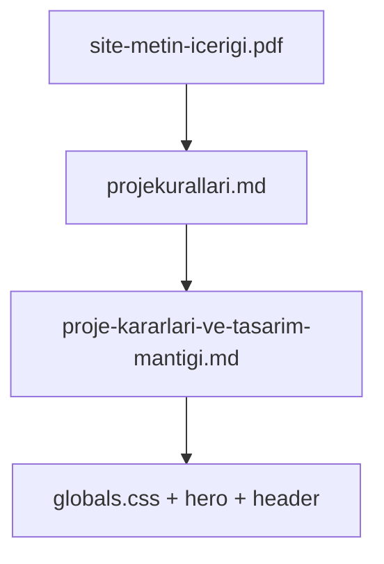

# Sultan Okulları Resmî Web Sitesi — Proje Kararları ve Tasarım Mantığı

> **Bu dosya kimler içindir?** İnsan geliştiriciler, Cursor agent'ları ve diğer yapay zeka araçları.
> **Amaç:** Projeyi hızlı anlamak, doğru kararlarla kod yazmak ve bu sohbette alınan **nihai tasarım kararlarını** kaybetmemek.
> **İlişki:** Bu dosya mevcut kuralları tamamlar; onların yerine geçmez.

---

## Kaynak hiyerarşisi (okuma sırası)

1. `docs/content/site-metin-icerigi.pdf` — tüm metinler (değiştirilemez)
2. `docs/rules/projekurallari.md` — teknik kurallar, grid disiplini, site haritası
3. **Bu dosya** — tasarım mantığı, sohbet kararları, hizalama/simetri (§4), hero/header derinlemesi
4. Kod: `src/app/(site)/globals.css`, `src/features/hero/*`, `src/components/layout/site-header.tsx`



---

## 1. Agent hızlı başlangıç

### 1.1 Proje özeti

| Alan              | Değer                                                                                           |
| ----------------- | ----------------------------------------------------------------------------------------------- |
| Proje             | Sultan Okulları resmî tanıtım web sitesi                                                        |
| Hedef kitle       | Mevcut ve potansiyel öğrenci / veli                                                             |
| Repo              | `github.com/virtualriddleinc/sultan-okullari-resmi-sitesi`                                      |
| Tasarım referansı | **Laptop / desktop hero görünümü** — mobil bu referansa uyarlanır, sıfırdan yeniden tasarlanmaz |

### 1.2 Mutlak kurallar (asla ihlal edilmez)

1. **Metin kaynağı:** Hiçbir metin uydurulmaz. Tüm kopya `docs/content/site-metin-icerigi.pdf` dosyasından birebir alınır.
2. **Gözle hizalama yok:** Tüm boşluklar explicit `calc()`, token veya grid hücresi ile tanımlanır.
3. **Layout-first:** Önce grid/flex iskeleti, Grid Inspector doğrulaması; sonra renk, tipografi, görsel.
4. **Desktop bozulmaz:** Mobil düzenlemeler `md` (768px) ve üzeri desktop layout'u etkilememelidir.

### 1.3 Bu sohbetten çıkan 5 nihai karar (öncelik sırası)

| #   | Karar                             | Açıklama                                                                                                                                                   |
| --- | --------------------------------- | ---------------------------------------------------------------------------------------------------------------------------------------------------------- |
| 1   | Laptop = doğru tasarım            | Hero, header, logo oranları desktop'ta referans alınır; **laptop layout'a dokunulmaz**                                                                     |
| 2   | Mobil sıralama (yalnızca telefon) | **Altıgen slider üstte → bilgi kartı altta**                                                                                                               |
| 3   | En-boy oranı                      | Altıgen medya konteyneri **43:24** — asla bozulmaz                                                                                                         |
| 4   | Telefon genişliği                 | Altıgen genişliği **bilgi kartı genişliği ile aynı** olmalı — **yalnızca `<768px` telefon görünümü için**; `100vw`, negatif margin ve full-bleed **yasak** |
| 5   | Logo mobilde                      | Sarı halka + beyaz damla + `SULTAN OKULLARI` yay metni laptop oranına yakın görünmeli                                                                      |

**Neden karar 4 geçerli?** Mevcut telefon görünümünde altıgen slider **çok küçük** kalıyor; bu da görselin okunmasını ve izlenmesini zorlaştırıyor. Altıgeni bilgi kartı ile **aynı content genişliğine** çekmek (oran korunarak) altıgeni büyütmenin doğru yoludur — ekranı taşırarak değil, aynı yatay alanı paylaşarak.

### 1.4 Çelişki çözüm kuralı

Kullanıcı talepleri zaman içinde evrilebilir. **En son kullanıcı mesajı geçerlidir.**

Örnek evrim (wave hariç):

- Önce: “Kenar boşlukları dışında maksimum geniş altıgen”
- Sonra: “Altıgen üstte, bilgi kartı altta” (kesinleşti)
- Sonra: “Ekranı tam kaplasın” (`100vw` denemesi — **reddedildi**)
- **En güncel:** “Yalnızca telefonda altıgen genişliği = bilgi kartı genişliği; negatif margin yok; laptop bozulmayacak”

### 1.5 Başarısız uygulama uyarısı (geri alınan iş)

Önceki agent denemesi bu talebi **yanlış algıladı**:

- Laptop/desktop hero layout'unu bozdu
- Telefon görünümünü yeterince düzeltemedi
- Kullanıcı değişiklikleri **geri aldı**

**Talep hâlâ geçerlidir;** yeterli düzenleme yapılamamıştır. Sonraki agent:

1. Önce **telefon** (`<768px`) düzenini hedeflemeli
2. `md+` desktop grid ve `calc()` token'larına **dokunmamalı**
3. Negatif margin, `100vw`, full-bleed **kullanmamalı**

### 1.6 Agent için kritik çıkarım

- Kod yazmadan önce bu dosyanın §7 (telefon hero) bölümünü oku.
- Genişlik eşitliği kuralı **yalnızca telefon** içindir; laptop'ta mevcut grid hesapları aynen kalır.
- Altıgeni büyütmek için negatif margin veya viewport taşması **yasak**; kart ile aynı `width: 100%` paylaşımı yeterlidir.
- Desktop hero'ya dokunurken `globals.css` içindeki `md+` grid token'larını koru.

---

## 2. Proje kimliği ve içerik disiplini

### 2.1 İçerik tek kaynak ilkesi

- **Kaynak:** `docs/content/site-metin-icerigi.pdf`
- **Yasak:** Lorem ipsum, placeholder, “örnek metin”, AI üretimi kopya
- **Yasak:** PDF'teki kelimelerde değişiklik (noktalama, büyük/küçük harf dahil)
- **Hero slider:** Metinler `src/features/hero/slides.ts` içinde PDF'ten alınmış olmalı

### 2.2 Marka renkleri

| Token / kullanım | Hex       | Bağlam                                      |
| ---------------- | --------- | ------------------------------------------- |
| Okul yeşili      | `#4cff00` | Hero arka plan, CTA vurguları, marka yeşili |
| Bal köpüğü       | `#fff085` | Header arka plan, bilgi kartı arka planı    |
| Kömür / metin    | `#1a1c18` | Gövde metni, nav linkleri, CTA koyu zemin   |

Tailwind: `--color-brand-green`, `--color-brand-honey`, `--color-charcoal` (`globals.css` `@theme`)

### 2.3 Site haritası ve navigasyon

Header'da 5 ana mega menü + merkez logo. Routing bu hiyerarşiye sıkı bağlıdır.

#### KURUMSAL

| Sayfa                      | Rota                                |
| -------------------------- | ----------------------------------- |
| Kurumsal Kimliğimiz        | `/kurumsal/kurumsal-kimligimiz`     |
| Niyetimiz ve İstikametimiz | `/kurumsal/niyetimiz-istikametimiz` |
| Nesil Tasavvurumuz         | `/kurumsal/nesil-tasavvurumuz`      |
| Kurumsal Değerlerimiz      | `/kurumsal/kurumsal-degerlerimiz`   |

#### EĞİTİM

| Sayfa                            | Rota                       |
| -------------------------------- | -------------------------- |
| Sultan Mektep Modeli & Kademeler | `/egitim/kademeler`        |
| Nebevî Eğitim ve Kur'an-i Kerîm  | `/egitim/nebevi-egitim`    |
| Değerler ve Mânevî Eğitim        | `/egitim/degerler-egitimi` |

#### AKADEMİK

| Sayfa                     | Rota                    |
| ------------------------- | ----------------------- |
| Akademik Gelişim ve Takip | `/akademik/gelisim`     |
| Yabancı Dil & Atölyeler   | `/akademik/yabanci-dil` |

#### REHBERLİK & VELİ

| Sayfa                                | Rota                        |
| ------------------------------------ | --------------------------- |
| Rehberlik ve Eğitim Koçluğu          | `/rehberlik/egitim-koclugu` |
| Sultanda Veli Olmak & Veli Akademisi | `/rehberlik/veli`           |

#### SULTANDA YAŞAM

| Sayfa          | Rota                    |
| -------------- | ----------------------- |
| Sultanda Yaşam | `/yasam/sultanda-yasam` |

#### OKULLARIMIZ

| Kampüs                | Rota                               |
| --------------------- | ---------------------------------- |
| Sancaktepe - İstanbul | `/okullarimiz/istanbul/sancaktepe` |
| Başiskele - Kocaeli   | `/okullarimiz/kocaeli/basiskele`   |
| Serdivan - Sakarya    | `/okullarimiz/sakarya/serdivan`    |
| Sincan - Ankara       | `/okullarimiz/ankara/sincan`       |
| Mevlânâ - Konya       | `/okullarimiz/konya/mevlana`       |

### 2.4 PR öncesi içerik kontrol listesi

- [ ] Yeni metin PDF'ten mi alındı?
- [ ] PDF'te olmayan başlık/CTA eklenmedi mi?
- [ ] Türkçe karakterler (â, î, û vb.) PDF ile birebir mi?

### 2.5 Agent için kritik çıkarım

- Metin eksikse kullanıcıdan PDF referansı iste; asla tahmin etme.
- Nav etiketleri ve slug'lar `src/lib/navigation.ts` ile senkron olmalı.

---

## 3. Teknoloji yığını ve mimari

### 3.1 Çekirdek yığın

| Katman              | Teknoloji                                                             |
| ------------------- | --------------------------------------------------------------------- |
| Framework           | Next.js (App Router) + TypeScript + React 19                          |
| Stil                | Tailwind CSS v4 — token'lar `src/app/globals.css` `@theme` bloğunda   |
| UI (öncelik sırası) | Headless UI + Heroicons → shadcn/ui + Radix → Tailwind + lucide-react |
| Form                | react-hook-form + zod + @hookform/resolvers                           |
| Animasyon           | framer-motion (`prefers-reduced-motion` uyumlu)                       |
| Kalite              | ESLint + Prettier (+ prettier-plugin-tailwindcss)                     |
| Yardımcı            | `cn()` — `src/lib/utils.ts` (clsx + tailwind-merge)                   |

### 3.2 Next.js uyarısı

Bu proje standart Next.js eğitim verisinden farklı API'lere sahip olabilir. Kod yazmadan önce `node_modules/next/dist/docs/` rehberine bak. `AGENTS.md` içindeki uyarı geçerlidir.

### 3.3 Dizin yapısı

```
src/
  app/                      # App Router sayfaları ve layout
  components/
    ui/                     # Temel UI (shadcn vb.)
    layout/                 # site-header.tsx, footer, mega menü
  features/
    hero/                   # hero-section, hero-slider, slides, geometry
  hooks/
  lib/                      # utils, navigation
  types/
docs/
  content/                  # site-metin-icerigi.pdf
  rules/                    # projekurallari.md, webgelistirme.md
  proje-kararlari-ve-tasarim-mantigi.md  # bu dosya
```

### 3.4 Komutlar

```bash
npm run dev        # geliştirme sunucusu
npm run build      # production derleme (PR öncesi zorunlu)
npm run lint       # ESLint
npm run typecheck  # tsc --noEmit
npm run format     # Prettier
```

### 3.5 Agent için kritik çıkarım

- Özellik kodu `features/` altında; sayfa ince routing `app/` altında.
- Tasarım token'ı eklerken `@theme` veya `:root` kullan; rastgele hex dağıtma.

---

## 4. Grid, hizalama ve layout-first felsefesi

### 4.1 Sıfıra sıfır hizalama ilkesi

Section'ların sol/sağ kenarları, header'daki ilk ve son `nav-link-header` butonunun **görsel bounding rect** kenarlarıyla örtüşmelidir.

**Kural A — Nav butonları:** `justify-self: stretch` + `justify-content: center`. `justify-self: center` **yasak** (buton daralır, hizalama kayar).

**Kural B — Outer gutter:** `padding-inline` ile değil, **explicit grid kolonu** ile tanımlanır.

### 4.2 Temel token'lar

| Token               | Değer             | Kullanım                   |
| ------------------- | ----------------- | -------------------------- |
| `--grid-gutter`     | `1.25rem` (20px)  | Kolonlar arası boşluk      |
| `--layout-margin`   | `0.3125rem` (5px) | Sayfa kenarı               |
| `--header-height`   | `90px` (md+)      | Satır yüksekliği hesapları |
| `--hero-top-spacer` | `calc(...)` (md+) | Logo sarkma payı (satır 1) |

Outer gutter formülü (sol):

```
var(--layout-margin) + clamp(1rem, 2.5vw, 2.5rem) + var(--grid-gutter)
```

### 4.3 Geliştirme sırası (zorunlu akış)

1. Grid token'larını belirle
2. `grid-template-columns` explicit yaz
3. `grid-template-rows` explicit yaz (`calc` + `svh`)
4. Her öğeyi `col-start/end`, `row-start/end` ile yerleştir
5. Tarayıcı Grid Inspector ile doğrula
6. Ancak sonra renk, tipografi, görsel ekle

### 4.4 Grid vs Flex

| Durum                       | Tercih                  |
| --------------------------- | ----------------------- |
| İki boyutlu section layout  | CSS Grid                |
| Nav öğeleri, buton grupları | Flexbox                 |
| Hero telefon dikey yığın    | Flex `column` + `order` |
| Hero desktop                | CSS Grid 4 kolon        |

### 4.5 Simetrik yerleşim ilkesi

Projede “simetrik” iki anlama gelir; agent her ikisini de ayırt etmelidir.

**A) Yatay simetri (sayfa ekseni):** Sol ve sağ outer gutter **aynı genişlikte** olmalıdır. Ekranın sol kenarından içeriğe olan mesafe, sağ kenardan içeriğe olan mesafeyle eşittir.

```
Sol outer gutter  ==  Sağ outer gutter
= var(--layout-margin) + clamp(1rem, 2.5vw, 2.5rem) + var(--grid-gutter)
```

**B) İçerik simetrisi (bileşen çiftleri):** Aynı satır veya yığında yan yana/dikey duran eşdeğer bileşenler aynı content genişliğini paylaşır; birinin taşması diğerinin hizasını bozmaz.

| Bağlam            | Simetrik çift                     | Kural                                                        |
| ----------------- | --------------------------------- | ------------------------------------------------------------ |
| Desktop hero grid | Col 1 buffer ↔ Col 4 buffer       | `var(--hero-grid-buffer)` — birebir eşit                     |
| Desktop hero grid | Col 2 bilgi kartı ↔ Col 3 altıgen | `1fr` + `1fr`; nav bandlarına göre `calc()` hizası (§6.5)    |
| Desktop nav       | Sol buffer ↔ Sağ buffer           | `nav-header-grid` dış kolonları eşit                         |
| Desktop header    | Logo                              | Col 5–6 ortası — sayfa merkez ekseni                         |
| **Telefon hero**  | Altıgen ↔ Bilgi kartı             | **Aynı flex parent, aynı `width: 100%`, aynı sol/sağ kenar** |
| Telefon header    | Logo                              | `absolute left-1/2 -translate-x-1/2` — yatay merkez          |

**Telefon hero simetrisi (bağlayıcı):** Altıgen ve bilgi kartının sol kenarı ve sağ kenarı piksel düzeyinde örtüşmelidir. Bu, altıgeni büyütmenin doğru yoludur; negatif margin veya `100vw` ile simetri bozulmamalıdır.

**`column-gap` kuralı:** Outer gutter ile içerik sütunları **farklı genişlikte** olduğunda `column-gap` kullanılmaz; boşluklar explicit kolon olarak tanımlanır. `column-gap` yalnızca tüm sütunlar arasında eşit aralık istenen, tam simetrik iç grid'lerde (ör. tekrarlayan kart ızgarası) tercih edilir.

### 4.6 Üç eksen hizalama kuralı

Tüm bileşenler görünmez bir grid veya flex sistemine oturur. Hizalama **gözle değil**, eksen sınıflarıyla yapılır (`projekurallari.md` §4).

| Eksen                         | CSS / Tailwind                                         | Ne zaman                                      |
| ----------------------------- | ------------------------------------------------------ | --------------------------------------------- |
| Başlangıç / Bitiş (Start/End) | `items-start`, `justify-start`, `self-start`           | Sola/sağa yaslı nav metni, kart içeriği bandı |
| Merkez (Center)               | `items-center`, `justify-center`, `place-items-center` | Logo, altıgen çerçeve merkezi, CTA grubu      |
| Taban çizgisi (Baseline)      | `items-baseline`                                       | Yan yana metin satırları aynı taban hizasında |

**Kritik uyarı:** Sola/sağa yaslı öğelerde girinti–çıkıntı çarpıklığı kabul edilmez. Bir öğe kolon sınırından içeri taşarsa bu explicit `calc()` veya grid hücresi ile giderilir; rastgele `margin` ile değil.

### 4.7 Outer gutter ve merkez gutter

**Outer gutter (sol ve sağ — simetrik):**

Desktop hero ve section grid'lerinde outer gutter **padding değil, kolondur**:

```css
grid-template-columns:
  var(--hero-grid-buffer) /* sol — nav col 1 ile birebir */
  1fr /* içerik sol */
  1fr /* içerik sağ */
  var(--hero-grid-buffer); /* sağ — nav col 10 ile birebir */
```

`--hero-grid-buffer` = `clamp(1rem, 2.5vw, 2.5rem)`; `--layout-margin` nav/header padding'inde ayrıca uygulanır.

**Merkez gutter:** İki içerik sütunu arasındaki 20px boşluk bağımsız bir grid kolonu veya `column-gap: var(--grid-gutter)` ile değil — hero desktop'ta `column-gap: var(--grid-gutter)` kullanılır ancak outer gutter'lar `column-gap`'e dahil edilmez; outer'lar explicit buffer kolonudur.

**Genişlik doğrulama formülü:**

```
2 × outer_gutter + Σ(içerik sütunları) + Σ(iç ayraçlar) = viewport genişliği
```

### 4.8 Hücre içi hizalama

Grid hücresindeki öğe konumlandırması (`projekurallari.md` §7.6):

| Durum             | Yöntem                                                                                         |
| ----------------- | ---------------------------------------------------------------------------------------------- |
| Hücre içi konum   | `justify-self` / `align-self` (margin ile değil)                                               |
| Hücreyi doldurma  | `justify-self: stretch` (varsayılan)                                                           |
| Flex içi ortalama | `justify-content: center` + `align-items: center`                                              |
| Grid içi ortalama | `place-items: center`                                                                          |
| Nav butonları     | `justify-self: stretch` + içeride `justify-content: center` — **`justify-self: center` yasak** |

Bileşen kendi grid hücresini doldurmalı; hücre dışına taşma yalnızca bilinçli tasarım kararıyla (ör. logo sarkması) ve token/`calc()` ile yapılır.

### 4.9 Görünüme göre hizalama tablosu (hero + header)

#### Desktop / laptop (≥768px hero grid, ≥1024px nav)

| Öğe                                  | Yatay hizalama                                          | Dikey hizalama                                 | Simetri notu                           |
| ------------------------------------ | ------------------------------------------------------- | ---------------------------------------------- | -------------------------------------- |
| İlk nav butonu (KURUMSAL) sol kenarı | Outer gutter sağ sınırı = section sol içerik başlangıcı | Header `90px` satırı                           | Sol referans noktası                   |
| Son nav butonu sağ kenarı            | Section sağ içerik bitişi                               | Aynı                                           | Sağ referans = sol ile simetrik mesafe |
| Logo merkezi                         | Sayfa orta ekseni (col 5–6)                             | Sarı halka header üstüne taşar (`top: -23px`)  | Merkez simetri                         |
| Bilgi kartı sol içerik               | KURUMSAL metin sol (`--hero-slide-content-inset-x`)     | Satır 2 üst hizası                             | Nav bandına kilitli                    |
| Bilgi kartı sağ sınır                | Logo sarı halka sol kavisi (`--hero-slide-card-width`)  | —                                              | Logo geometrisine bağlı                |
| Altıgen medya bandı sol              | Logo sarı halka sağ kavisi                              | Satır 2; Y senkronu `--hero-slide-sync-height` | Kart ile Y ekseninde eşit yükseklik    |
| Altıgen medya bandı sağ              | OKULLARIMIZ metin sağ (`--hero-slide-media-band-width`) | —                                              | Nav bandına kilitli                    |
| Hero col 1 ↔ col 4                   | Eşit buffer                                             | —                                              | **Yatay simetri**                      |

#### Telefon (`<768px`)

| Öğe                               | Yatay hizalama                                     | Dikey hizalama                       | Simetri notu                           |
| --------------------------------- | -------------------------------------------------- | ------------------------------------ | -------------------------------------- |
| Header logo                       | Ekran yatay merkezi                                | Sarı halka header altına sarkar      | Merkez simetri                         |
| `.hero-section-grid`              | `padding-inline: var(--layout-margin)` — sol = sağ | Flex column                          | Kenar boşlukları simetrik              |
| Altıgen (`.hero-slide-media-col`) | `width: 100%` — parent içerik alanı                | `order: 1`, logo sarkma `margin-top` | Kart ile **sol/sağ kenar örtüşür**     |
| Bilgi kartı (`.hero-slide-fill`)  | `width: 100%` — aynı parent                        | `order: 2`, `margin-top: 1rem`       | Altıgen ile **sol/sağ kenar örtüşür**  |
| Altıgen ↔ kart arası              | —                                                  | Dikey yığın; kart altta              | Sıra sabit; genişlik simetrisi zorunlu |

### 4.10 Hizalama doğrulama checklist (agent)

Grid Inspector veya dev tools ile **kod yazmadan önce/sonra** kontrol et:

**Genel (tüm section'lar):**

- [ ] Outer gutter sol kenarı = ilk `nav-link-header` görsel sol kenarı (sıfıra sıfır)
- [ ] Outer gutter sağ kenarı = son `nav-link-header` görsel sağ kenarı (sıfıra sıfır)
- [ ] Sol ve sağ outer gutter genişlikleri eşit
- [ ] İçerik sütunları gerektiğinde simetrik (sol içerik genişliği = sağ içerik genişliği, `1fr` + `1fr` hero'da)
- [ ] Hizalama margin ile değil, grid hücresi / `justify-self` / `align-self` ile
- [ ] Gözle “yaklaşık” px ayarı yok

**Desktop hero:**

- [ ] Col 1 buffer genişliği = Col 4 buffer genişliği
- [ ] Bilgi kartı sol içerik = KURUMSAL nav metin sol
- [ ] Altıgen bandı nav metin bandına göre `calc()` ile hizalı
- [ ] Logo merkez eksende

**Telefon hero:**

- [ ] Altıgen sol kenarı = bilgi kartı sol kenarı (360 / 390 / 430 px)
- [ ] Altıgen sağ kenarı = bilgi kartı sağ kenarı
- [ ] Negatif margin yok; `100vw` full-bleed yok
- [ ] Logo yatayda ortalı; altıgenin üstünde, kartın içine taşmıyor
- [ ] Laptop (≥1024px) layout önceki haliyle aynı

### 4.11 Yasaklar (özet)

- `padding-inline` ile outer gutter oluşturmak
- Margin ile grid hizalaması (`margin-left: 40px` gözle)
- **Negatif margin** ile telefon hero'da altıgeni genişletmek (kullanıcı açıkça reddetti)
- `100vw` / full-bleed ile telefon hero'da altıgeni ekrana yaslamak
- Sabit px kolon genişlikleri (fluid olmayan)
- Gözle “yaklaşık” hizalama
- Grid ve tasarım detaylarını aynı anda kurmak
- `column-gap` ile outer gutter simüle etmek
- Telefon düzeltmesi yaparken `md+` desktop hero token'larını değiştirmek
- Sola/sağa yaslı öğelerde çarpık girinti–çıkıntı (hizasız kenarlar)
- `justify-self: center` nav butonlarında (bounding rect daralır)

### 4.12 Agent için kritik çıkarım

- Hero desktop: `hero-section-grid` 4 kolon; col 1 = col 4 buffer simetrisi; nav-header-grid ile sıfıra sıfır hizalama.
- Hero telefon: altıgen ve kart **aynı sol/sağ kenar** — bu simetrik yerleşim kuralı genişlik eşitliğinin görsel ifadesidir.
- Hizalama sorunları renk/tipografi eklenmeden önce Grid Inspector ile çözülür (§4.10).
- Telefon kurallarının doğru media query katmanında olması gerekir (bkz. §7.7 teknik borç).

---

## 5. Header ve logo sistemi

### 5.1 Dosyalar ve bileşenler

- **Ana dosya:** `src/components/layout/site-header.tsx`
- **CSS sınıfları:** `.central-identity`, `.logo-drop-area`, `.nav-header-grid`, `.nav-link-header`
- **Logo bileşeni:** `CentralLogo()` — Link + sarı halka (::before) + beyaz damla + SVG textPath

### 5.2 Desktop (lg+, ≥1024px)

| Öğe                     | Değer                                 |
| ----------------------- | ------------------------------------- |
| Header yüksekliği       | `90px` (`h-[90px]`)                   |
| Header zemin            | `#fff085` (bal köpüğü)                |
| Nav grid                | 10 kolon: buffer + 8×nav + buffer     |
| Logo konumu             | col 5–6 ortası                        |
| Sarı halka (`::before`) | `220px`, `top: -23px`, `z-index: 120` |
| Beyaz damla             | `165px`, `top: 5px`, `z-index: 130`   |
| Mega menü               | Hover ile açılır; buzlu cam backdrop  |

### 5.3 Mobil (< lg)

| Öğe                 | Davranış                                                                             |
| ------------------- | ------------------------------------------------------------------------------------ |
| Layout              | Hamburger sol, logo orta (`absolute left-1/2 -translate-x-1/2`), “Sizi Arayalım” sağ |
| Logo                | Desktop ile aynı `CentralLogo` bileşeni; sarı halka header altına sarkar             |
| Sarı halka (fluid)  | `clamp(140px, 35vw, 160px)`                                                          |
| Beyaz damla (fluid) | `clamp(105px, 25vw, 120px)`                                                          |
| Drawer              | Headless UI Dialog; sağdan kayan mobil menü                                          |

### 5.4 “SULTAN OKULLARI” yay metni (SVG textPath)

Kullanıcı özellikle vurguladı: **mobilde laptop'taki gibi görünmeli.**

| Özellik             | Değer                                             |
| ------------------- | ------------------------------------------------- |
| Font                | `var(--font-cinzel)` (Cinzel)                     |
| fontWeight          | `600`                                             |
| letterSpacing       | `3`                                               |
| SVG viewBox         | `-82.5 -82.5 165 165`                             |
| Path                | Alt yarım daire: `M -102,0 A 102,102 0 0,0 102,0` |
| fontSize (SVG attr) | `14`                                              |
| Tailwind sınıfı     | `text-[12px] md:text-[14px]`                      |
| textPath            | `startOffset="50%"`, `textAnchor="middle"`        |

Yay metni `logo-drop-area` içinde, `z-[1]` ile beyaz dairenin üzerinde konumlanır.

### 5.5 Z-index hiyerarşisi (logo ve hero)

| Katman                  | z-index | Öğe                         |
| ----------------------- | ------- | --------------------------- |
| Header wrapper          | `1000`  | Site header container       |
| Sarı halka              | `120`   | `.central-identity::before` |
| Beyaz damla + yay metin | `130`   | `.logo-drop-area`           |
| Bilgi kartı (mobil)     | `10`    | `.hero-slide-fill`          |
| Altıgen medya (mobil)   | `1`     | `.hero-slide-media-col`     |
| Hero section            | `1`     | `.hero-section-grid`        |

Logo, hem altıgen hem bilgi kartının **üstünde** görünür; kartın içeriği logonun altına taşmamalı (sarkma payı altıgen kolonunda).

### 5.6 Agent için kritik çıkarım

- Logo boyutları mobilde `clamp()` ile fluid; desktop'ta CSS değişkenleri (`--logo-yellow-ring-size: 220px` vb., md+ `:root`).
- Yay metin boyutunu küçültmek mobilde “laptop gibi” hedefiyle çelişir; `12px–14px` bandında tut.

---

## 6. Hero section — desktop referans tasarım

### 6.1 Dosya haritası

| Dosya                                | Rol                                                                 |
| ------------------------------------ | ------------------------------------------------------------------- |
| `src/features/hero/hero-section.tsx` | Section iskeleti, arka plan deseni, logo spacer, HeroSlider çağrısı |
| `src/features/hero/hero-slider.tsx`  | Bilgi kartı + altıgen medya, animasyon, navigasyon                  |
| `src/features/hero/geometry.ts`      | Çerçeve ve altıgen oran sabitleri                                   |
| `src/features/hero/slides.ts`        | Slayt verisi (PDF kaynaklı)                                         |
| `src/app/globals.css`                | Grid token'ları, boyutlandırma, breakpoint kuralları                |

### 6.2 Desktop grid yapısı (md+, ≥768px)

**4 kolon × 2 satır:**

```
[col1: buffer] [col2: bilgi kartı] [col3: altıgen medya] [col4: buffer]
[row1: logo sarkma spacer]
[row2: slider — viewport doldurucu]
```

- `grid-template-columns`: `var(--hero-grid-buffer) 1fr 1fr var(--hero-grid-buffer)`
- `column-gap`: `var(--grid-gutter)` (20px)
- Satır 1: `var(--hero-top-spacer)` — logo sarı halka alt sınırı
- Satır 2: `calc(100svh - var(--header-height) - var(--hero-top-spacer))`

`svh` kullanımı: mobil tarayıcı adres çubuğu kaymasına karşı dayanıklı viewport yüksekliği.

### 6.3 Görsel katmanlar

| Katman          | Açıklama                                         |
| --------------- | ------------------------------------------------ |
| Zemin           | `#4cff00` (okul yeşili)                          |
| Desen           | `beyaz-desen.svg`, opacity ~0.1, absolute merkez |
| Bilgi kartı     | `#fff085`, `rounded-[2rem]`, gölge               |
| Altıgen çerçeve | `cerceve_1.png`, `object-contain`                |
| Altıgen medya   | clip-path altıgen, `object-cover` + focal point  |

### 6.4 Geometri sabitleri (`geometry.ts`)

```typescript
CONTAINER_ASPECT_RATIO = 43 / 24
FRAME_OUTER_WIDTH_RATIO ≈ 0.5727
FRAME_OUTER_HEIGHT_RATIO ≈ 0.8639
HEXAGON_CLIP_WIDTH_PCT = 45.64
HEXAGON_CLIP_HEIGHT_PCT = 68.69
```

`hero-slider.tsx` içindeki mask inset (değiştirilmez):

```typescript
const HEX_MASK_INSET = {
  left: "27.18%",
  right: "27.18%",
  top: "15.49%",
  bottom: "15.82%",
};
const HEX_CLIP_PATH =
  "polygon(25% 0%, 75% 0%, 100% 50%, 75% 100%, 25% 100%, 0% 50%)";
```

### 6.5 Desktop hizalama mantığı

Desktop'ta bilgi kartı ve altıgen medya **nav metin bandlarına** göre hizalanır. Yatay simetri: hero col 1 buffer = col 4 buffer (bkz. §4.5).

- Bilgi kartı sol içerik: KURUMSAL metin sol kenarı (`--hero-slide-content-inset-x`)
- Bilgi kartı genişliği: logo sarı halka sol kavisine kadar (`--hero-slide-card-width`)
- Altıgen medya bandı: logo sarı halka sağ → OKULLARIMIZ metin sağ (`--hero-slide-media-band-width`)
- Y ekseni senkronu: `--hero-slide-sync-height` ile kart ve görünür çerçeve yüksekliği eşitlenir

Tüm bu değerler `globals.css` içinde `md+` `:root` bloğunda `calc()` ile tanımlıdır.

### 6.6 Slider davranışı

| Özellik         | Uygulama                                 |
| --------------- | ---------------------------------------- |
| Otomatik geçiş  | rAF döngüsü; hover'da duraklar           |
| Klavye          | ArrowLeft / ArrowRight                   |
| Touch           | 50px swipe eşiği                         |
| Metin animasyon | `AnimatePresence` + `textVariants`       |
| Medya animasyon | Ayrı `AnimatePresence` + `mediaVariants` |
| Erişilebilirlik | `prefers-reduced-motion` → süre 0        |

### 6.7 Agent için kritik çıkarım

- Desktop hero **asla** telefon flex order kurallarıyla bozulmamalı.
- Desktop hizalama `calc()` token'larına bağlıdır; simetri §4.5 ve §4.9 tablosuna göre doğrulanır.
- `cerceve_1.png` için `object-contain` kullan; `object-fill` çerçeveyi deforme eder.
- Geometri sabitlerini değiştirmeden önce `geometry.ts` ve görsel asset'i birlikte değerlendir.

---

## 7. Hero section — telefon nihai kararlar

> Bu bölüm, kullanıcının bu sohbette en çok vurguladığı konuları içerir. Agent'lar **yalnızca telefon hero** (`<768px`) üzerinde çalışırken **önce burayı** okumalıdır. Laptop/desktop (≥768px) layout **dokunulmaz**.

### 7.1 Temel ilke ve sorun tanımı

**Laptop/desktop hero doğru tasarımdır.** Telefon, aynı bileşenleri farklı sıra ve genişlik kurallarıyla dikey yığına uyarlar. Yeni bir telefon-only tasarım icat edilmez.

**Mevcut sorun (telefon):** Altıgen slider telefon ekranında **çok küçük** kalıyor. Görsel içerik sıkışık görünüyor; kullanıcı deneyimi zayıflıyor. Bu, düzeltilmesi gereken **açık bir UX sorunudur**.

**Hedef sonuç:** Altıgen, bilgi kartı ile **aynı yatay genişliği** paylaşarak büyüsün. `aspect-ratio: 43/24` korunduğunda genişlik artışı yüksekliği de orantılı artırır — görsel daha okunaklı hale gelir.

**Kapsam sınırı:**

| Görünüm                    | Altıgen genişlik kuralı                                          |
| -------------------------- | ---------------------------------------------------------------- |
| Telefon (`<768px`)         | Altıgen genişliği = bilgi kartı genişliği (**uygulanacak**)      |
| Tablet / laptop (`≥768px`) | Mevcut 4 kolon grid + `calc()` token sistemi (**değiştirilmez**) |

### 7.2 Dikey sıralama (kesin)

| Sıra | Bileşen            | CSS `order` | DOM notu                   |
| ---- | ------------------ | ----------- | -------------------------- |
| 0    | Logo sarkma spacer | `0`         | `hero-section.tsx` boş div |
| 1    | Altıgen medya      | `1`         | `.hero-slide-media-col`    |
| 2    | Bilgi kartı        | `2`         | `.hero-slide-fill`         |

Bileşenlerde `style={{ order: N }}` ve CSS `order: N !important` birlikte kullanılmıştır (Tailwind çakışmasını önlemek için).

**Kullanıcı kararı:** Altıgen **üstte**, bilgi kartı **altta**. Bu sıra tersine çevrilmemelidir.

### 7.3 Logo sarkma payı (mobil)

Logo header'dan aşağı sarkar; altıgen kolonu bu payı karşılar:

```css
margin-top: calc(140px - 23px - 90px + 1.5rem);
/* ≈ 47px + 1.5rem — sarı halka alt sınırı - header + boşluk */
```

- `140px`: mobil sarı halka boyutu (`clamp` minimum)
- `-23px`: sarı halka `top` offset
- `90px`: header yüksekliği
- `+ 1.5rem`: nefes payı

Bilgi kartında logo sarkması için aşırı `padding-top` (`pt-16`, `pt-20`) **gerekmez**; hedef `pt-8` civarı.

### 7.4 Altıgen genişlik — nihai karar (yalnızca telefon)

| Yaklaşım                                               | Durum                                                        |
| ------------------------------------------------------ | ------------------------------------------------------------ |
| Kenar boşlukları dışında maksimum genişlik             | Erken talep; telefon için yetersiz kaldı                     |
| `100vw` + negatif `margin-inline`                      | Denendi; **reddedildi** — kullanıcı negatif margin istemiyor |
| Laptop grid token'larını değiştirerek “mobil düzeltme” | Denendi; laptop bozuldu → **geri alındı**                    |
| **Bilgi kartı ile aynı genişlik (telefon)**            | **Nihai ve geçerli karar**                                   |

**Neden bu yaklaşım doğru?**

- Bilgi kartı telefonda zaten kullanılabilir content genişliğini dolduruyor
- Altıgen aynı genişliğe çekilince **ekstra büyüme** kazanır (şu anki küçük görünümün tersi)
- Kenar boşlukları (`--layout-margin`) korunur; layout-first disipline uygun
- Negatif margin veya viewport taşması gerekmez

**Olması gereken uygulama (telefon, `<768px`):**

```css
/* .hero-section-grid — telefon base katmanı */
.hero-section-grid {
  display: flex;
  flex-direction: column;
  padding-inline: var(--layout-margin); /* kenar boşluğu yalnızca burada */
  min-height: 100svh;
}

/* İki kardeş aynı flex parent içinde eşit genişlik */
.hero-slide-media-col,
.hero-slide-fill {
  width: 100%;
  margin-left: 0;
  margin-right: 0;
  box-sizing: border-box;
}

.hero-slide-media-band {
  width: 100%;
  max-width: 100%;
  /* İç padding minimumda tutulabilir; negatif margin ile telafi EDİLMEZ */
  padding-inline: 0;
}

.hero-slide-media {
  aspect-ratio: 43 / 24;
  width: 100%;
  height: auto;
}
```

**Açık yasaklar (telefon hero):**

- `width: 100vw`
- `margin-left` / `margin-right` negatif değerler
- `padding-inline: 0 !important` ile parent boşluğunu iptal etmek
- `md+` (`@media (width >= 768px)`) desktop grid kurallarını değiştirmek

**Desktop koruma kuralı:** `@media (width >= 768px)` bloğundaki `.hero-section-grid` grid yapısı, `--hero-slide-media-band-width` vb. `calc()` token'ları **aynen korunmalı**. Telefon düzeltmesi bu bloğa yazılmamalı.

### 7.5 En-boy oranı (kilitli)

```css
.hero-slide-media {
  aspect-ratio: 43 / 24;
  width: 100%;
  height: auto;
}
```

- Görsel: `object-cover` + isteğe bağlı `focalPoint`
- Çerçeve: `object-contain`
- `sizes` attribute (mobil): `(max-width: 1024px) 100vw` yerine kart genişliğine uygun değer tercih edilir

### 7.6 Mobil layout konteyneri

```css
.hero-section-grid {
  display: flex;
  flex-direction: column;
  padding-inline: var(--layout-margin);
  min-height: 100svh;
}
```

Bilgi kartı ile altıgen aynı yatay kapsayıcıyı paylaşır; kart `margin-top: 1rem` ile altıgenden ayrılır.

### 7.7 Bilinen teknik borç ve yapılması gerekenler

> **Durum:** Kullanıcı talebi geçerlidir; kod henüz yeterince uygulanmamıştır. Önceki agent denemesi geri alınmıştır.

#### Borç 1: Media query nesting hatası (kök neden)

`globals.css` içinde telefon `flex` + `order` + genişlik kuralları şu an `@media (width >= 768px)` bloğunun **içinde** tanımlı (satır ~832–911). Bu, `<768px` gerçek telefonda bu kuralların **uygulanmamasına** neden olur — bu yüzden önceki düzenlemeler yansımamış olabilir.

**Yapılması gereken:**

- Telefon kurallarını `@layer base` altındaki **varsayılan** (`<768px`) katmana taşı
- Desktop grid override'ı ayrı, izole `@media (width >= 768px)` bloğunda kalsın
- İki katman birbirini ezmemeli

#### Borç 2: Genişlik çelişkisi — negatif margin (reddedilen yaklaşım)

Mevcut kodda (yazım anı) telefon için yanlış yaklaşım:

```css
/* YANLIŞ — kullanıcı reddetti, uygulanmamalı */
.hero-slide-media-col {
  width: 100vw;
  margin-left: calc(-1 * var(--layout-margin));
  margin-right: calc(-1 * var(--layout-margin));
}
```

**Olması gereken (telefon):**

```css
.hero-slide-media-col {
  width: 100%;
  margin-left: 0;
  margin-right: 0;
}
```

Negatif margin **hiçbir koşulda** telefon hero genişlik düzeltmesi için kullanılmamalı.

#### Borç 3: Laptop'un bozulması riski

Önceki denemede agent telefon kurallarını `md+` bloğunun içine veya desktop token'larına müdahale ederek laptop görünümünü bozdu. Kullanıcı işlemi geri aldı.

**Yapılması gereken:**

- Telefon CSS'i yalnızca `<768px` base katmanında
- `md+` içindeki `.hero-section-grid` grid, `--hero-slide-media-band-width`, `--hero-slide-card-width` vb. **dokunulmaz**
- Değişiklik sonrası **1024px+ laptop** görünümü ilk doğrulama adımı olmalı

#### Borç 4: Inline style + !important karmaşası

`order` için hem React `style={{ order }}` hem CSS `!important` kullanılıyor. Media query düzeltmesi sonrası sadeleştirilebilir; ancak desktop'ta order reset (`md:order-none`) korunmalı.

### 7.8 Telefon doğrulama checklist

| Genişlik | Kontrol                                                           |
| -------- | ----------------------------------------------------------------- |
| 360px    | Altıgen ve kart sol/sağ kenar hizası aynı mı? (simetrik yerleşim) |
| 390px    | Logo yay metni okunaklı mı?                                       |
| 430px    | Altıgen yüksekliği oran koruyarak büyüyor mu?                     |
| 768px    | Telefon → desktop geçişi kırılmadan mı?                           |
| 1024px+  | Orijinal laptop layout bozulmuyor mu?                             |

Ek kontroller:

- [ ] Altıgen bilgi kartının **üstünde**
- [ ] Altıgen sol kenarı = kart sol kenarı; altıgen sağ kenarı = kart sağ kenarı
- [ ] Logo altıgenin üzerinde (sarkma), kartın üzerine taşmıyor
- [ ] Negatif margin ve `100vw` yok
- [ ] `npm run build` başarılı

> Tam hizalama checklist: §4.10

### 7.9 Agent için kritik çıkarım

- Telefon hero'da dört şeyi aynı anda doğrula: **sıra**, **genişlik eşitliği (kart = altıgen)**, **43:24 oran**, **laptop bozulmuyor**.
- Altıgen küçük kalma sorunu, kart ile aynı `width: 100%` paylaşımıyla çözülür — negatif margin veya `100vw` ile değil.
- Negatif margin **kesinlikle kullanılmamalı**; kullanıcı bunu açıkça belirtti.
- CSS media query nesting borcunu düzeltmeden telefon değişikliklerinin yansımayacağını unutma.
- Önce laptop'u doğrula, sonra telefonu; önceki hata laptop'u bozup telefonu düzeltememekti.

---

## 8. Karar öncelik hiyerarşisi ve kronoloji

### 8.1 Sohbet kronolojisi (wave hariç)

| Aşama | Kullanıcı talebi                                                             | Sonuç                                                  |
| ----- | ---------------------------------------------------------------------------- | ------------------------------------------------------ |
| 1     | Laptop referans; logo laptop gibi; altıgen üstte; max genişlik; oran korunur | Temel mobil strateji                                   |
| 2     | Referans görsele göre modern responsive iyileştirme                          | Logo z-index, padding, hizalama ince ayarı             |
| 3     | Plan onayı ve uygulama                                                       | CSS order, margin, wave pozisyon denemeleri            |
| 4     | “Altıgen üstte, bilgi kartı altta; max genişlik” (V2 plan)                   | Sıralama kesinleşti                                    |
| 5     | “Değişiklikler yansımamış”                                                   | `order !important`, inline style                       |
| 6     | Logo yay metni laptop gibi değil; altıgen çok küçük                          | `clamp` logo, `text-[12px]`, `100vw` denemesi          |
| 7     | “Altıgen genişliği = bilgi kartı genişliği”                                  | **Nihai genişlik kuralı (yalnızca telefon)**           |
| 8     | Agent laptop'u bozdu, telefonu düzeltemedi                                   | Kullanıcı **geri aldı**; talep geçerli, uygulama eksik |
| 9     | “Negatif margin istemiyorum; yalnızca telefon için kart = altıgen”           | **Güncel ve bağlayıcı talimat**                        |

### 8.2 Öncelik kuralı

```
En son kullanıcı mesajı > Bu doküman > projekurallari.md > Eski plan dosyaları (.cursor/plans/)
```

Plan dosyaları (`*.plan.md`) kullanıcı istemedikçe düzenlenmez; nihai kararlar **bu dosyada** tutulur.

### 8.3 Agent için kritik çıkarım

- Eski planlarda “wave order: 3” gibi maddeler geçerse yok say (wave kaldırıldı, dokümante edilmez).
- Genişlik konusunda en güncel kural: **yalnızca telefonda kart ile eşit**; negatif margin ve full-bleed yasak.
- Geri alınan iş = laptop bozuldu; bir sonraki denemede desktop korunması öncelikli doğrulama adımıdır.

### 8.4 Site geneli layout matrisi (Temmuz 2026)

`projekurallari.md` §8 ile sabitlenen kararlar:

| Karar | Değer |
| ----- | ----- |
| Tip A | Full-bleed / `SectionGrid` / nav-hizalı; `max-w-* mx-auto` yasak |
| Tip B | `PageShell` + `.page-shell-content` (72rem) yalnızca içerik sayfalarında |
| Tip C | Özel sayfalar; outer gutter yine nav token'larıyla |
| Yapısal kırılım | Telefon `<768`, tablet `768–1023`, desktop `≥1024` (`md`/`lg`) |
| `sm:` prefix | Yalnızca ince tipografi/spacing; kolon yapısı değiştirmez |
| Fluid spacing | `fluid-1`…`fluid-16` (ara: 3, 6, 12 dahil) |
| Negatif margin | İçerik section'larda yasak |
| Test kapısı | 360 / 390 / 768 / 1024 / 1280 / 1536 |

Stil yolu: `src/app/(site)/globals.css` — eski `src/app/globals.css` referansları buna işaret eder.
`cn()` gerçek yolu: `src/lib/cn.ts`.

---

## 9. Dosya ve seçici referansı (cheat sheet)

### 9.1 Dosya → sorumluluk

| Dosya                                   | Sorumluluk                                                             |
| --------------------------------------- | ---------------------------------------------------------------------- |
| `src/app/(site)/globals.css`            | Design token'lar, hero grid/flex, logo boyutları, breakpoint kuralları |
| `src/features/hero/hero-section.tsx`    | Section iskeleti, arka plan deseni, logo spacer                        |
| `src/features/hero/hero-slider.tsx`     | Bilgi kartı + altıgen medya, animasyon, mask, navigasyon               |
| `src/features/hero/geometry.ts`         | Çerçeve/altıgen oran sabitleri                                         |
| `src/features/hero/slides.ts`           | Slider içerik verisi                                                   |
| `src/components/layout/site-header.tsx` | Header, logo SVG, mega menü, mobil drawer                              |
| `src/components/layout/section-grid.tsx`| Tip A/B section kabuğu (`.section-page-grid`)                          |
| `src/lib/navigation.ts`                 | Nav section tanımları, rotalar                                         |
| `src/lib/cn.ts`                         | `cn()` yardımcısı                                                      |

### 9.2 Kritik CSS sınıfları

| Sınıf                    | Bağlam                                         |
| ------------------------ | ---------------------------------------------- |
| `.hero-section-grid`     | Hero ana konteyner (mobil flex / desktop grid) |
| `.hero-slide-fill`       | Bilgi kartı kolonu                             |
| `.hero-slide-card`       | Sarı kart kutusu                               |
| `.hero-slide-content`    | Kart iç padding bandı                          |
| `.hero-slide-media-col`  | Altıgen medya kolonu                           |
| `.hero-slide-media-band` | Altıgen genişlik bandı                         |
| `.hero-slide-media`      | 43:24 aspect-ratio konteyner                   |
| `.central-identity`      | Logo sarı halka wrapper                        |
| `.logo-drop-area`        | Beyaz damla + yay metin                        |
| `.nav-header-grid`       | Desktop 10 kolon nav                           |
| `.nav-link-header`       | Nav buton stili                                |
| `.mega-menu-grid`        | Mega menü kolon hizası                         |

### 9.3 Kritik React bileşenleri

| Bileşen       | Export                    | Dosya              |
| ------------- | ------------------------- | ------------------ |
| `HeroSection` | default section           | `hero-section.tsx` |
| `HeroSlider`  | fragment (2 grid hücresi) | `hero-slider.tsx`  |
| `SiteHeader`  | header + mega + drawer    | `site-header.tsx`  |
| `CentralLogo` | internal                  | `site-header.tsx`  |

### 9.4 Agent için kritik çıkarım

- Hero mobil değişikliği = `globals.css` + `hero-slider.tsx` (+ gerekirse `hero-section.tsx`).
- Logo değişikliği = `site-header.tsx` + `globals.css` `.central-identity` / `.logo-drop-area`.

---

## 10. Agent çalışma protokolü

### 10.1 Yeni özellik veya düzeltme akışı

1. `docs/rules/projekurallari.md` oku
2. **Bu dosyayı** oku (özellikle §4 hizalama/simetri ve §7 telefon hero)
3. İlgili bileşen dosyasını oku
4. Metin gerekiyorsa `docs/content/site-metin-icerigi.pdf` aç
5. Layout/grid önce; tasarım detayı sonra
6. Mobil (360–430px) ve desktop (1024px+) birlikte doğrula
7. `npm run format && npm run build`
8. Plan dosyalarını (`*.plan.md`) kullanıcı istemedikçe düzenleme

### 10.2 Hero telefon düzeltme mini-reçete

```
0. Laptop (≥1024px) mevcut görünümü kaydet / önce doğrula — bozulmayacak
1. Telefon kurallarını YALNIZCA <768px base katmanına yaz
2. order: media=1, card=2 doğrula
3. media-col VE card: width 100% — aynı flex parent, aynı content genişliği
4. margin-left/right: 0 — negatif margin KESİNLİKLE yok
5. 100vw, full-bleed, padding-inline iptali: yok
6. aspect-ratio: 43/24 koru (genişlik artınca yükseklik otomatik büyür)
7. logo margin-top altıgen kolonunda
8. md+ desktop grid ve calc() token'larına dokunma
9. Telefonda (360–430px) altıgen ≥ önceki küçük halinden büyük mü kontrol et
```

### 10.3 PR reddedilme nedenleri (sık görülen)

- Uydurma metin
- Gözle margin/padding
- **Laptop/desktop layout bozulması** (önceki geri alma nedeni)
- Negatif margin kullanımı
- `100vw` / full-bleed telefon hero'da
- Altıgen oranı deforme
- Telefon sıralama ters (kart üstte)
- Telefonda altıgen ve kart genişlik uyumsuzluğu
- Telefonda altıgen hâlâ çok küçük (kart ile eşit genişlik uygulanmamış)

### 10.4 Agent için kritik çıkarım

- Bu dosya “proje hafızası”dır; belirsizlikte §7 ve §8'e dön.
- Kod ile belgelenmiş karar çelişiyorsa önce borcu düzelt, sonra özellik ekle.

---

## Ek: Hızlı referans tablosu (tüm nihai kararlar)

| Konu                                | Nihai değer                                               |
| ----------------------------------- | --------------------------------------------------------- |
| Tasarım referansı                   | Laptop/desktop hero                                       |
| Mobil sıra                          | Altıgen → Bilgi kartı                                     |
| Aspect ratio                        | 43:24 (sabit)                                             |
| Telefon altıgen genişlik (`<768px`) | = Bilgi kartı genişliği (negatif margin yok)              |
| Laptop altıgen genişlik (`≥768px`)  | Mevcut grid `calc()` sistemi (değiştirilmez)              |
| Logo mobil                          | Laptop davranışı + fluid clamp                            |
| Yay metin                           | Cinzel, 12–14px, letterSpacing 3                          |
| Hero arka plan                      | `#4cff00` + beyaz desen                                   |
| Bilgi kartı rengi                   | `#fff085`                                                 |
| Header yüksekliği                   | 90px                                                      |
| Desktop breakpoint (hero grid)      | md (768px)                                                |
| Desktop nav breakpoint              | lg (1024px)                                               |
| Hizalama ilkesi                     | Sıfıra sıfır; outer gutter sol = sağ; gözle px yok        |
| Telefon simetrik yerleşim           | Altıgen ve bilgi kartı aynı sol/sağ kenar (`width: 100%`) |
| Desktop hero simetri                | Col 1 buffer = Col 4 buffer; logo merkez eksende          |
| Site layout tipi                    | A full-bleed / B PageShell / C özel (projekurallari §8)   |
| Yapısal breakpoint                  | `<768` telefon · `768–1023` tablet · `≥1024` desktop      |

---

_Son güncelleme bağlamı: Temmuz 2026 — site geneli responsive layout matrisi (`projekurallari.md` §8) eklendi. Hero telefon kuralları (altıgen = kart, negatif margin yasak, laptop korunur) geçerliliğini korur._
